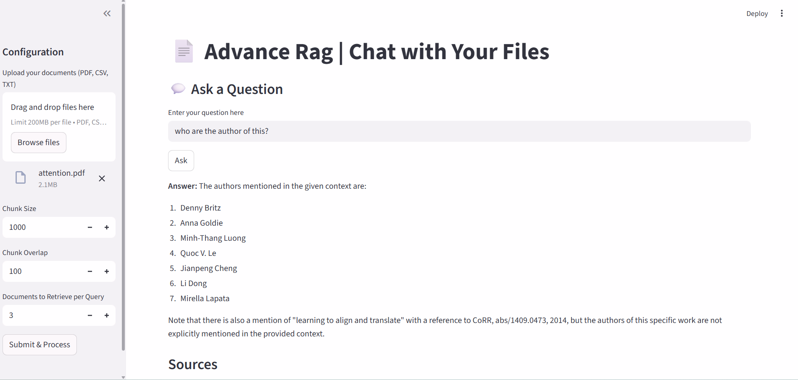
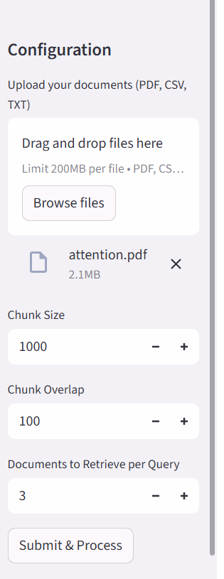

# Advanced RAG Document Q&A System

An advanced Retrieval-Augmented Generation (RAG) system that enables intelligent, context-aware question answering over PDF documents with conversational memory and low-latency inference using Groq.

---

## Key Features

* Chat with PDFs – Upload documents and ask questions in natural language
* Conversational Memory – Supports multi-turn conversations with context retention
* Low-Latency Responses – Powered by Groq for fast inference
* High Accuracy Retrieval – Optimized chunking with vector similarity search
* Context-Aware Answers – Reduces hallucinations using grounded responses
* Interactive UI – Built with Streamlit for real-time interaction

---

## Architecture Overview

```
User Query → Embedding → Vector Store Retrieval → Context Injection → LLM → Response
```

---

## Tech Stack

| Technology            | Role                |
| --------------------- | ------------------- |
| Python                | Core Language       |
| LangChain             | RAG Pipeline        |
| ChromaDB              | Vector Database     |
| Groq API              | LLM Inference       |
| Streamlit             | Web Interface       |
| PyPDF                 | Document Processing |
| Sentence Transformers | Embeddings          |

---

## Screenshots

### Home Interface


### Chat Interaction



### Conversation Memory


### Sidebar Settings



---

## Project Structure

```
advanced-rag-doc-qa/
│── app.py
│── rag_utils.py
│── requirements.txt
│── .gitignore
│── README.md
│── screenshots/
│   ├── home_ui.png
│   ├── chat_interaction.png
│   ├── conversation_memory.png
│   ├── sidebar_settings.png
```

---

## Installation and Setup

### Clone the Repository

```
git clone https://github.com/Saumya-eng/rag-document-intelligence-system.git
cd rag-document-intelligence-system
```

### Create Virtual Environment

```
python -m venv rag_env
rag_env\Scripts\activate      # Windows
source rag_env/bin/activate   # Mac/Linux
```

### Install Dependencies

```
pip install --upgrade pip
pip install -r requirements.txt
```

### Configure Environment Variables

Create a `.env` file in the root directory:

```
GROQ_API_KEY=your_api_key_here
```

### Run the Application

```
streamlit run app.py
```

---

## How It Works

1. User uploads a document (PDF, CSV, or TXT)
2. Text is split into optimized chunks
3. Chunks are converted into embeddings
4. Stored in Chroma vector database
5. User submits a query
6. Relevant chunks are retrieved
7. Context is passed to the LLM
8. Model generates a response

---

## Performance Highlights

* Fast response time using Groq inference
* Efficient retrieval using vector similarity search
* Supports multi-turn conversational queries

---

## Limitations

* Supports text-based documents only
* Requires internet connection for LLM responses
* Performance depends on document quality and chunking

---

## Future Improvements

* Add source citation highlighting
* Implement re-ranking for better retrieval accuracy
* Add support for image-based documents
* Deploy with scalable vector databases

---

## Use Cases

* Academic research and study assistant
* Enterprise document search
* Knowledge base chatbot
* Customer support automation

---

## Author

Saumya Verma
B.Tech CSE (AI/ML)
Focused on building AI-powered real-world applications
